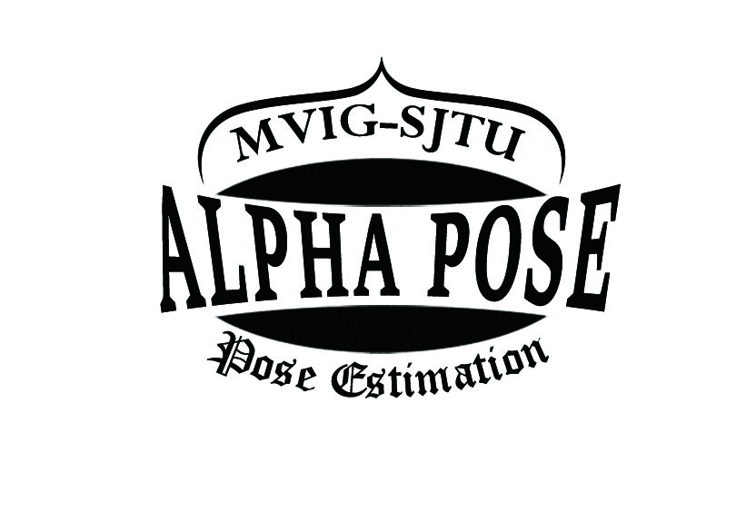
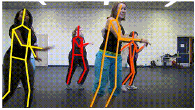
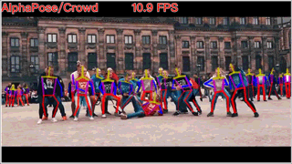

<div align="center">
    
</div>


## News!
- Apr 2019: [**MXNet** version](https://github.com/MVIG-SJTU/AlphaPose/tree/mxnet) of AlphaPose is released! It runs at **23 fps** on COCO validation set.
- Feb 2019: [CrowdPose](https://github.com/MVIG-SJTU/AlphaPose/blob/pytorch/doc/CrowdPose.md) is integrated into AlphaPose Now!
- Dec 2018: [General version](https://github.com/MVIG-SJTU/AlphaPose/tree/pytorch/PoseFlow) of PoseFlow is released! 3X Faster and support pose tracking results visualization!
- Sep 2018: [**PyTorch** version](https://github.com/MVIG-SJTU/AlphaPose/tree/pytorch) of AlphaPose is released! It runs at **20 fps** on COCO validation set (4.6 people per image on average) and achieves 71 mAP!

## AlphaPose
[Alpha Pose](http://www.mvig.org/research/alphapose.html) is an accurate multi-person pose estimator, which is the **first open-source system that achieves 70+ mAP (72.3 mAP) on COCO dataset and 80+ mAP (82.1 mAP) on MPII dataset.** 
To match poses that correspond to the same person across frames, we also provide an efficient online pose tracker called Pose Flow. It is the **first open-source online pose tracker that achieves both 60+ mAP (66.5 mAP) and 50+ MOTA (58.3 MOTA) on PoseTrack Challenge dataset.**

AlphaPose supports both Linux and **Windows!**

<div align="center">
    
</div>


## Installation
**Windows Version** please check out [doc/win_install.md](doc/win_install.md)

1. Get the code.
  ```Shell
  git clone -b pytorch https://github.com/MVIG-SJTU/AlphaPose.git
  ```

2. Install [pytorch 0.4.0](https://github.com/pytorch/pytorch) and other dependencies.
  ```Shell
  pip install -r requirements.txt
  ```

3. Download the models manually: **duc_se.pth** (2018/08/30) ([Google Drive]( https://drive.google.com/open?id=1OPORTWB2cwd5YTVBX-NE8fsauZJWsrtW) | [Baidu pan](https://pan.baidu.com/s/15jbRNKuslzm5wRSgUVytrA)), **yolov3-spp.weights**([Google Drive](https://drive.google.com/open?id=1D47msNOOiJKvPOXlnpyzdKA3k6E97NTC) | [Baidu pan](https://pan.baidu.com/s/1Zb2REEIk8tcahDa8KacPNA)). Place them into `./models/sppe` and `./models/yolo` respectively.


## Quick Start
- **Input dir**:  Run AlphaPose for all images in a folder with:
```
python3 demo.py --indir ${img_directory} --outdir examples/res 
```
- **Video**:  Run AlphaPose for a video and save the rendered video with:
```
python3 video_demo.py --video ${path to video} --outdir examples/res --save_video
```
- **Webcam**:  Run AlphaPose using webcam and visualize the results with:
```
python3 webcam_demo.py --webcam 0 --outdir examples/res --vis
```
- **Input list**:  Run AlphaPose for images in a list and save the rendered images with:
```
python3 demo.py --list examples/list-coco-demo.txt --indir ${img_directory} --outdir examples/res --save_img
```
- **Note**:  If you meet OOM(out of memory) problem, decreasing the pose estimation batch until the program can run on your computer:
```
python3 demo.py --indir ${img_directory} --outdir examples/res --posebatch 30
```
- **Getting more accurate**: You can enable flip testing to get more accurate results by disable fast_inference, e.g.:
```
python3 demo.py --indir ${img_directory} --outdir examples/res --fast_inference False
```
- **Speeding up**:  Checkout the [speed_up.md](doc/speed_up.md) for more details.
- **Output format**: Checkout the [output.md](doc/output.md) for more details.
- **For more**:  Checkout the [run.md](doc/run.md) for more options

## Pose Tracking

<p align='center'>
    
    
</p>

Please read [PoseFlow/README.md](PoseFlow/) for details.

### CrowdPose
<p align='center'>
    
</p>

Please read [doc/CrowdPose.md](doc/CrowdPose.md) for details.


## FAQ
Check out [faq.md](doc/faq.md) for faq.

## Contributors
Pytorch version of AlphaPose is developed and maintained by [Jiefeng Li](http://jeff-leaf.site/), [Hao-Shu Fang](https://fang-haoshu.github.io/), [Yuliang Xiu](http://xiuyuliang.cn) and [Cewu Lu](http://www.mvig.org/). 

## Citation
Please cite these papers in your publications if it helps your research:

    @inproceedings{fang2017rmpe,
      title={{RMPE}: Regional Multi-person Pose Estimation},
      author={Fang, Hao-Shu and Xie, Shuqin and Tai, Yu-Wing and Lu, Cewu},
      booktitle={ICCV},
      year={2017}
    }

    @inproceedings{xiu2018poseflow,
      author = {Xiu, Yuliang and Li, Jiefeng and Wang, Haoyu and Fang, Yinghong and Lu, Cewu},
      title = {{Pose Flow}: Efficient Online Pose Tracking},
      booktitle={BMVC},
      year = {2018}
    }


## License
AlphaPose is freely available for free non-commercial use, and may be redistributed under these conditions. For commercial queries, please drop an e-mail at mvig.alphapose[at]gmail[dot]com and cc lucewu[[at]sjtu[dot]edu[dot]cn. We will send the detail agreement to you.
