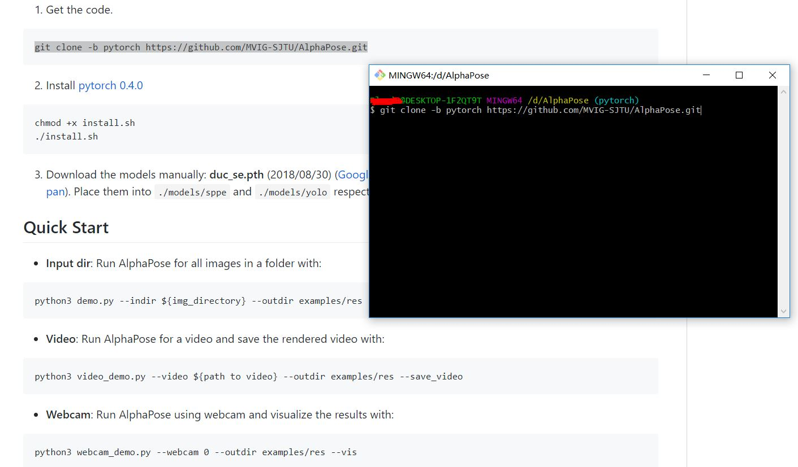

AlphaPose - Windows Installation
============================================

Tested on Win10 with GTX 1060

1. Download and install Git for Windows: https://git-scm.com/download/win
2. Download and install Python3(3.6 or 3.7): https://www.python.org/downloads/
3. Download and install CUDA toolkit: https://developer.nvidia.com/cuda-downloads
4. Download and install PyTorch: https://pytorch.org/
	Right click, choose the "Git Bash Here"
	<div align="left">
    
	</div>
	Input the command here and press Enter
	<div align="left">
    
	</div>
5. 	Download win-64/intel-openmp-2018.0.0-8.tar.bz2: https://anaconda.org/anaconda/intel-openmp/files
	put the .dll files in Library\bin into a dir, then append the path of it to the environment variable PATH. 
	I suggest you to put it in C:\Users\<Your user name>\bin since this dir is already in the PATH
6. Right click, choose the "Git Bash Here" and then follow the instructions in README to install AlphaPose
	<div align="left">
    
	</div>
7. Have fun! Now you can run AlphaPose by entering command. Try webcam demo by input 
```
python3 webcam_demo.py --vis
```
**Note:** For `demo.py` and `video_demo.py`, you need to turn on the `--sp` flag, like

```
python3 demo.py --indir ${img_directory} --outdir examples/res --sp
```

<div align="left">

</div>